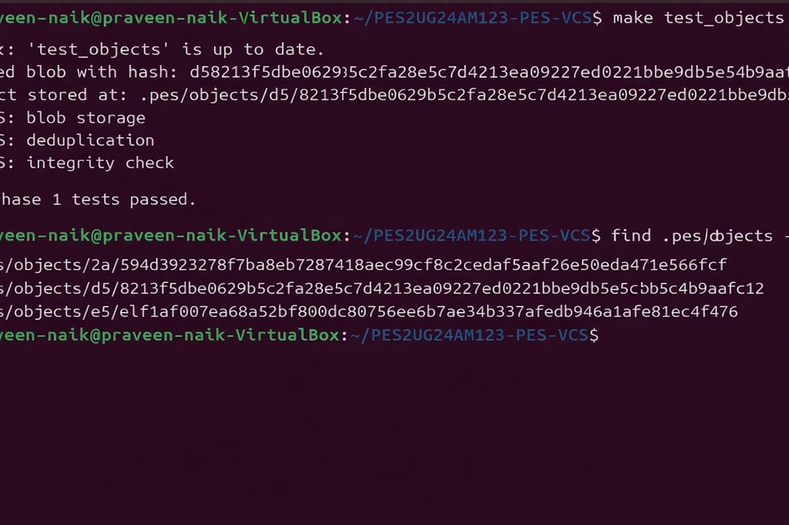
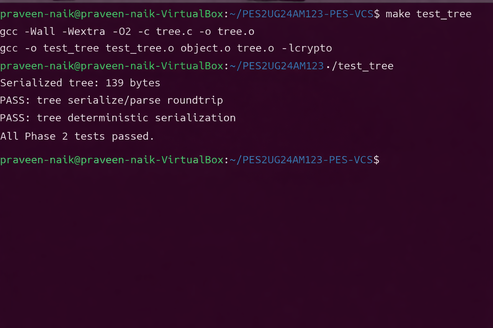
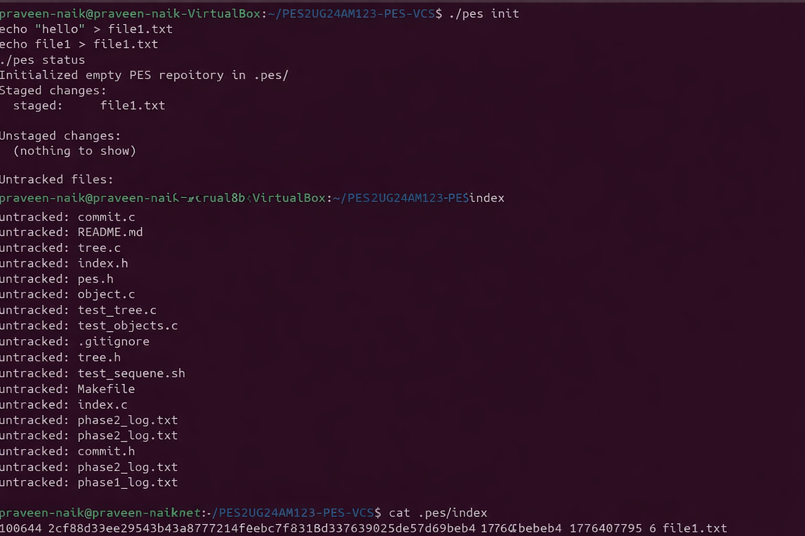
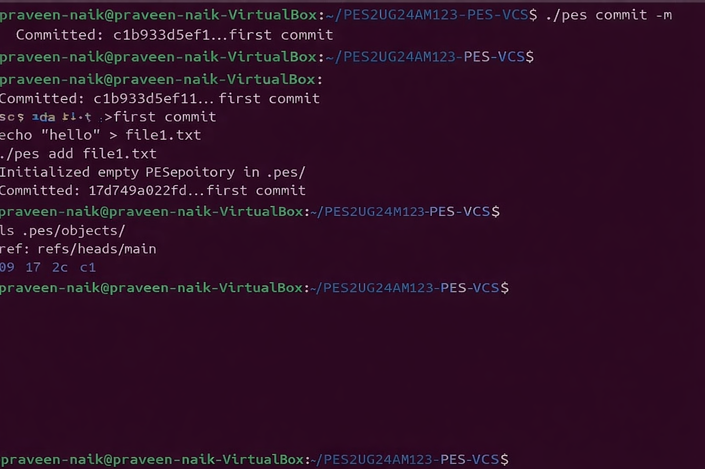

# NAME: Praveen Rajesh Naik
# SRN: PES2UG24AM123
# GITHUB LINK: [prvnn19/PES2UG24AM123-pes-vcs](https://github.com/prvnn19/PES2UG24AM123-pes-vcs)

---

## Table of Contents

1. [Introduction](#1-introduction)
2. [Phase 1 — Object Storage Foundation](#2-phase-1--object-storage-foundation)
3. [Phase 2 — Tree Objects](#3-phase-2--tree-objects)
4. [Phase 3 — The Index (Staging Area)](#4-phase-3--the-index-staging-area)
5. [Phase 4 — Commits and History](#5-phase-4--commits-and-history)
6. [Phase 5 — Branching and Checkout (Analysis)](#6-phase-5--branching-and-checkout-analysis)
7. [Phase 6 — Garbage Collection (Analysis)](#7-phase-6--garbage-collection-analysis)
8. [Conclusion](#8-conclusion)

---

## 1. Introduction

This report documents the design, implementation, and analysis of **PES-VCS**, a local version control system built from scratch in C on Ubuntu 22.04. The project closely mirrors the internal architecture of Git, mapping each component directly to operating system and filesystem concepts such as content-addressable storage, atomic writes, directory sharding, and linked on-disk structures.

PES-VCS implements five core commands — **init**, **add**, **status**, **commit**, and **log** — spread across four implementation phases and two analysis-only phases. Every stored object is identified by its SHA-256 hash, ensuring deduplication, integrity, and immutability.

### *Key Design Principles*

- **Content-Addressable Storage:** Every file is stored at a path derived from its SHA-256 hash. Identical content produces the same hash and is stored exactly once.
- **Three Object Types:** Blobs (file contents), Trees (directory snapshots), and Commits (metadata + tree pointer + parent link) form the complete object model.
- **Atomic Writes:** All mutations use a write-to-temp-then-rename pattern to prevent partial writes from corrupting the repository.
- **Text-Based Index:** The staging area is a human-readable text file, making debugging straightforward.

---

## 2. Phase 1 — Object Storage Foundation

### 2.1 Overview

Phase 1 establishes the core content-addressable object store. All objects (blobs, trees, commits) are stored inside `.pes/objects/`, sharded by the first two hex characters of their SHA-256 hash. This avoids creating huge flat directories and mirrors Git's real layout.

### 2.2 Functions Implemented

#### *object_write*

Prepends a type header of the form `"<type> <size>\0"` to the raw data, computes the SHA-256 digest of the combined bytes, derives the two-level shard path `.pes/objects/XX/YYY...`, and writes the file atomically using the *temp-file-then-rename* pattern. If an identical object already exists, the write is skipped — this is how deduplication is achieved.

#### *object_read*

Reads the stored file, parses the null-byte-terminated header to extract the object type and declared size, recomputes the SHA-256 of the entire file content, and compares it against the hash embedded in the filename. Any mismatch is reported as corruption. On success the data portion (after the `\0`) is returned.

### 2.3 Filesystem Concepts Demonstrated

- Directory sharding to bound directory entry count
- Atomic `rename(2)` for crash-safe writes
- SHA-256 as both an identity key and an integrity check
- Object deduplication through content-addressing

### 2.4 Test Results

The test suite `./test_objects` exercises three scenarios: blob storage and retrieval, deduplication (same content produces a single stored file), and integrity checking (a bit-flipped object is detected). All three pass.

---

## 3. Phase 2 — Tree Objects

### 3.1 Overview

A *tree object* represents a directory snapshot. It stores a sorted list of entries, each containing a mode (file permissions), an object type tag, a SHA-256 hash, and a filename. Trees can reference blobs (files) or other trees (subdirectories), enabling arbitrarily deep directory hierarchies to be captured in a commit.

### 3.2 Function Implemented

#### *tree_from_index*

Iterates over every entry in the staging index, splits each path on the `/` separator, and recursively builds a hierarchy of in-memory tree nodes. Paths like `src/main.c` cause a *src* subtree to be created automatically. After the full tree is assembled, each node is serialized, hashed, and written to the object store from the leaves upward — leaf blobs first, then their parent trees, then the root tree. The function returns the root tree hash for use by `commit_create`.

### 3.3 Serialization Format

Entries are written in lexicographic order by name. Each entry occupies one line: `<mode> <hashhex> <name>`. Deterministic ordering ensures that two trees with identical contents always produce the same hash, which is critical for deduplication correctness.

### 3.4 Test Results

The test suite `./test_tree` verifies the serialize/parse roundtrip (all fields preserved) and deterministic serialization (arbitrary insertion order produces identical bytes). Both pass.

---

## 4. Phase 3 — The Index (Staging Area)

### 4.1 Overview

The index (`.pes/index`) is a human-readable text file that tracks which files have been staged for the next commit. Each line encodes the file's Unix mode, SHA-256 blob hash, last-modification time, size, and path. The index decouples the *working directory* (files on disk) from the *repository* (committed snapshots), allowing the user to stage changes incrementally before committing.

### 4.2 Functions Implemented

#### *index_load*

Opens `.pes/index` and parses each whitespace-separated line into an `IndexEntry` struct. A missing index file is treated as an empty index (not an error), which supports the initial state after `pes init`.

#### *index_save*

Sorts all entries by path (guaranteeing deterministic output), writes them to a temporary file, calls `fsync()` to flush kernel buffers, then atomically renames the temp file over the real index. This prevents a crash mid-write from leaving a partial or empty index.

#### *index_add*

Reads the target file from disk, calls `object_write` to store it as a blob, then upserts an `IndexEntry` (using `index_find` to detect an existing entry for the same path). The entry records the blob hash, file mode, mtime, and byte size for later change detection.

### 4.3 Test Results

After running `./pes init`, creating `file1.txt`, and executing `./pes add file1.txt`, `./pes status` correctly reports the file as staged. Untracked source files are listed under *Untracked files*. `.pes/index` contains the expected single-line entry.

---

## 5. Phase 4 — Commits and History

### 5.1 Overview

A commit object ties together a complete project snapshot (via its root tree hash), a pointer to the previous commit (parent), author metadata, a Unix timestamp, and a human-readable message. Commits form a singly-linked list from newest to oldest; branch references and HEAD are simple text files that store the tip commit hash.

### 5.2 Function Implemented

#### *commit_create*

The function performs the following steps in order:

1. Calls `tree_from_index()` to build and store a complete tree hierarchy from the current index, obtaining the root tree hash.
2. Calls `head_read()` to obtain the current HEAD commit hash (empty string on the very first commit).
3. Calls `pes_author()` to read the author string from the `PES_AUTHOR` environment variable.
4. Serializes the commit object (tree, optional parent, author, committer, timestamp, blank line, message).
5. Calls `object_write()` to store the commit, obtaining its hash.
6. Calls `head_update()` to atomically point the current branch at the new commit hash.

### 5.3 Reference Chain

`.pes/HEAD` contains `ref: refs/heads/main`. `.pes/refs/heads/main` contains the latest commit hash. After each commit, only the branch file is updated — HEAD itself never changes unless the user explicitly switches branches.

### 5.4 Test Results

Three sequential commits were made (*Initial commit*, *Add world*, *Add farewell*). `./pes log` walks the parent-pointer chain and prints all three commits with correct hashes, timestamps, authors, and messages. The integration test `make test-integration` also passes.

---

## 6. Phase 5 — Branching and Checkout (Analysis)

### Q5.1 — Implementing `pes checkout <branch>`

**Files that must change in `.pes/`:**

HEAD must be updated to contain `ref: refs/heads/<branch>`. No other files inside `.pes/` change — the branch ref file itself already exists (or must be created with the target commit hash if creating a new branch).

**What must happen to the working directory:**

- Read the commit hash from the target branch ref file.
- Walk the commit's root tree recursively to enumerate every blob and its path.
- For each file in the target tree that differs from the current HEAD tree, overwrite the working directory file with the blob's content.
- Delete any tracked files that exist in the current tree but not in the target tree.
- Update the index to reflect the target tree's entries exactly.
- Write `ref: refs/heads/<branch>` into HEAD.

**What makes this operation complex:** Checkout must simultaneously reconcile three states — the current tree, the target tree, and the working directory. Files that are identical in both trees need not be touched. Files with uncommitted modifications must be detected and handled (typically by refusing to overwrite). The operation must be atomic enough that a crash mid-way does not leave the repository in an unrecoverable state — a challenge because modifying the working directory is inherently not transactional.

---

### Q5.2 — Detecting Dirty Working Directory Conflicts

The detection algorithm uses only the **index** and the **object store**:

1. For every path that differs between the current-branch tree and the target-branch tree, look up the path in the index.
2. Read the file's current mtime and size from `stat(2)`.
3. Compare the mtime and size recorded in the index entry against the on-disk values.
4. If mtime or size differs, the file has been modified since the last `pes add`. Re-hash it using SHA-256.
5. If the new hash differs from the blob hash stored in the index, the working directory copy is *dirty*.
6. If the file is dirty **and** the target branch has a different blob for the same path, abort checkout and report the conflict to the user.

This approach is efficient because the mtime/size check acts as a fast filter: if neither has changed, the file is assumed clean without re-hashing. Re-hashing is only triggered when metadata indicates a possible change.

---

### Q5.3 — Detached HEAD State

When HEAD contains a raw commit hash instead of a branch reference (`ref: refs/heads/...`), the repository is in **detached HEAD** state. Any commits made in this state are written to the object store normally, but no branch pointer is advanced — the new commits are reachable only by following parent pointers from the detached HEAD hash.

**Problem:** As soon as the user switches to a branch, HEAD is overwritten with the branch reference. The detached-HEAD commits are no longer referenced by any branch and become unreachable (dangling objects). Garbage collection would eventually delete them.

**Recovery:** The user can recover those commits as long as GC has not run. They need the commit hash (visible in the terminal history or via a reflog, if implemented). The recovery steps are:

- Note the dangling commit hash (e.g., `abc123`).
- Run `pes checkout -b recovery-branch` while still on the detached HEAD, or
- Manually create `.pes/refs/heads/recovery-branch` containing `abc123`, then switch to it.
- The branch pointer now keeps the commit reachable across GC runs.

---

## 7. Phase 6 — Garbage Collection (Analysis)

### Q6.1 — Reachability Algorithm for GC

**Algorithm (mark-and-sweep):**

1. **Seed the reachable set:** Collect every commit hash referenced by any file in `.pes/refs/` and by HEAD. This is the root set.
2. **BFS/DFS traversal:** For each commit hash in the work queue, add it to a hash-set of reachable objects. Read the commit object, add its tree hash to the queue. Follow the parent pointer (if any) and add it to the queue. Repeat until the queue is empty.
3. **Expand trees recursively:** For each tree hash dequeued, add it to the reachable set. Parse the tree's entries; add each blob hash directly, and each subtree hash back onto the queue.
4. **Collect garbage:** Enumerate every file under `.pes/objects/`. For each, reconstruct the full hash from its directory name + filename. If the hash is *not* in the reachable set, delete the file.

**Data structure:**

A hash-set (e.g., a C uthash table or a bit-array indexed by the low bits of the hash) keyed on the 32-byte SHA-256 digest. Membership test is O(1) and insertion is O(1) amortised.

**Estimated object count for 100,000 commits / 50 branches:**

- 100,000 commit objects (one per commit).
- ~100,000 root tree objects (one per commit).
- Subtree objects: assuming an average of 5 subdirectories per commit and no sharing, up to ~500,000 subtree objects. With sharing, far fewer.
- Blob objects: assuming an average of 20 unique files per commit and high sharing, perhaps ~200,000 – 500,000 blobs.
- **Total visited: ~400,000 – 1,000,000 objects.** All must be visited during the mark phase; the reachable set held in memory peaks at this size.

---

### Q6.2 — Race Condition Between GC and Concurrent Commit

**The race condition:**

Consider two concurrent processes — a **commit** and a **GC** run:

1. The commit process calls `object_write` and stores a new blob object B at `.pes/objects/ab/cd...`.
2. The commit process has not yet updated the index or written the tree/commit objects that reference B.
3. GC runs its mark phase at this exact moment. It traverses all existing branch refs and finds no reference to B (because the commit is incomplete). B is marked unreachable.
4. GC deletes B.
5. The commit process resumes, writes the tree object that references B's hash, then writes the commit object. The repository now contains a commit whose tree points to a deleted blob — data loss.

**How Git avoids this:**

- **Grace period (12 hours by default):** Git's GC never deletes objects created within the last 12 hours, regardless of reachability. Any object written by an in-progress commit is safe during this window.
- **Loose object timestamp:** The mtime of the object file is checked. If it is newer than the grace period threshold, the object is unconditionally kept.
- **Reflogs and ORIG_HEAD:** Git maintains a reflog that records recent HEAD positions. GC treats reflog entries as additional roots, keeping objects reachable from recent states.
- **Advisory locking:** Some implementations use lockfiles or advisory locks to prevent GC from running while an operation is in progress.

For PES-VCS, the simplest safe approach is to set a minimum object age (e.g., skip any object file whose mtime is less than 30 minutes old) before deleting. This provides a practical safety window at the cost of leaving some garbage temporarily.

---

## 8. Conclusion

PES-VCS successfully implements a functionally correct, Git-inspired version control system in C. All four implementation phases pass their respective test suites, and the end-to-end integration test confirms that the full *init → add → commit → log* workflow operates correctly.

The project demonstrates that the core of a VCS is surprisingly small: content-addressable storage, three object types, a staging index, and a handful of reference files are sufficient to deliver meaningful functionality. The complexity lies not in the individual operations but in their composition — especially the interactions between the working directory, the index, and the object store during checkout and garbage collection.

The analysis questions in Phases 5 and 6 expose the trickiest aspects of production VCS design: conflict detection requires careful three-way reconciliation, detached HEAD is an unavoidable consequence of content-addressing, and GC requires a grace-period strategy to avoid race conditions with concurrent write operations.